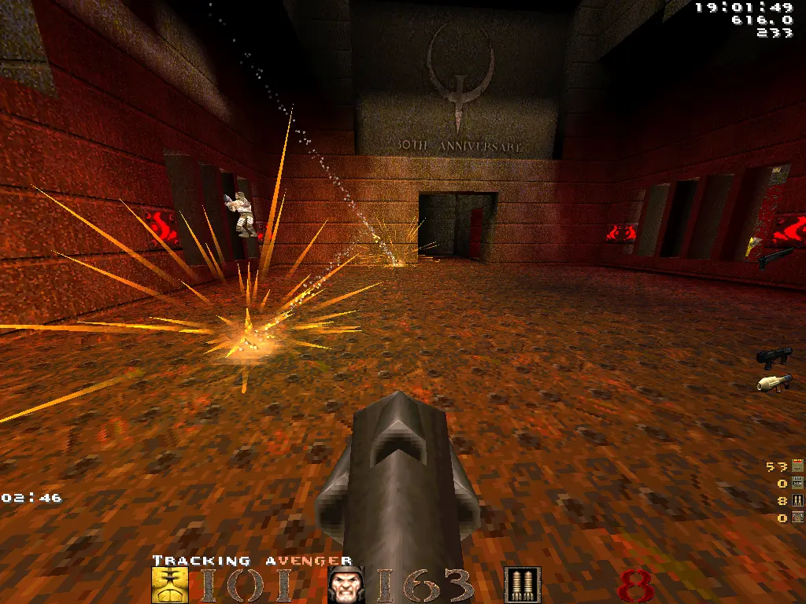

  

# classicQ

A QuakeWorld client for the **30th anniversary of Quake** (June 22, 2026).

## Download

You'll need `pak0.pak` and `pak1.pak` from a licensed copy of Quake. Available on [Steam](https://store.steampowered.com/app/2310/Quake/), [GOG](https://www.gog.com/game/quake_the_offering), or that dusty CD from 1996.

With those in hand, grab the classicQ binary from [the releases page](https://github.com/classicq/classicq/releases) and drop the `.pak` files into `assets/id1/`.

## Build from source

1. Install [Zig](https://ziglang.org/download/).
2. Clone the repo.
3. Run `zig build`.

Binary lands in `assets/` next to the configs. Run from there.

Oh, and on Linux you also need SDL2's dev package first. Try this:

- Ubuntu: `sudo apt install libsdl2-dev`
- Fedora: `sudo dnf install SDL2-devel`
- Arch: `sudo pacman -S sdl2`
- openSUSE: `sudo zypper install libSDL2-devel`

## Credits

- **Quake**
  - id Software
- **ZQuake**
  - Tonik
- **FuhQuake**
  - fuh
- **Fodquake**
  - bigfoot
  - Tuna
  - Jogi
- **classicQ**
  - mg

### Tip of the hat

**[ezQuake](https://ezquake.com/)** - reference for modern QuakeWorld compatibility and optimizations. For feature-rich gameplay with modern graphical options, ezQuake is *the* recommended client for most users.

The entire [QuakeWorld community](https://quake.world/) co-created the clients above through code, maps, mods, and graphics. If you feel you've been left out, please create an issue and you'll be added to the credits.

